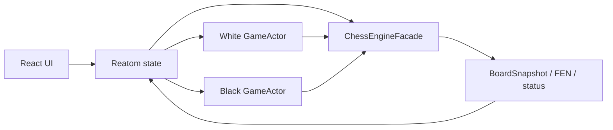

# AI Chess Battle

`AI Chess Battle` - это шахматное веб-приложение, в котором можно играть
человеку против AI, а также запускать матчи AI против AI. Первая цель проекта -
сделать удобный и расширяемый MVP, где игровой цикл не зависит от того, кто
делает ход: игрок, локальный бот или внешний AI-провайдер.

## Current Status

Проект пока находится на стадии проектирования MVP.

- Репозиторий еще не развернут как приложение.
- Этот `README` фиксирует целевую архитектуру и ближайшие шаги реализации.
- Все команды и структура ниже относятся к планируемому состоянию проекта, а не
  к уже существующей кодовой базе.

## Что должно получиться

На первом этапе нужен не "AI-комбайн", а надежная шахматная основа:

- корректное состояние доски;
- явный API для получения доступных фигур и доступных ходов;
- единый интерфейс актора игры для человека и AI;
- UI-конфигурация AI-ботов с ключом, моделью и provider-specific настройками;
- возможность без переделки игрового контура переключаться между
  `human vs AI` и `AI vs AI`.

## Технологический стек

- `TypeScript`
- `pnpm`
- `Vite`
- `React`
- `Reatom v1000` - основа для состояния приложения и реактивной композиции:
  [v1000.reatom.dev](https://v1000.reatom.dev)

## MVP-принципы

- Сначала один `Vite + React` app.
- Доменная логика отделяется от UI с первого дня.
- Шахматные правила для MVP строятся как обертка над готовым rules-engine.
- Рекомендуемый кандидат для правил: [chess.js](https://github.com/jhlywa/chess.js).
- Наружу приложение отдает не API библиотеки, а собственный фасад домена.
- Каноническое внешнее представление позиции - `FEN`.
- Формат хода внутри приложения - структурированный объект, с маппингом в `UCI`.
- Первый слой AI-провайдеров описывается абстрактно, без жесткой привязки к
  одному сервису.

## Архитектурная идея

Игровой цикл должен быть одинаковым для человека и для AI:

1. Движок отдает текущий снимок позиции.
2. Активный актор получает контекст хода.
3. Актор возвращает ход в едином формате.
4. Движок валидирует и применяет ход.
5. UI и следующий актор получают уже обновленное состояние.



Ключевая идея: игра работает с абстракцией `GameActor` и не знает, кто именно
сделал ход. За счет этого один и тот же контур запускает:

- `human vs AI`
- `AI vs AI`
- позже `human vs human`, если понадобится

## Шахматный движок и состояние

Для MVP под капотом используется готовая библиотека правил, но UI и домен
работают только с собственным фасадом:

```ts
type Side = 'white' | 'black'
type Square = string
type FenString = string
type UciMove = string

type PieceSnapshot = {
  id: string
  side: Side
  type: 'pawn' | 'knight' | 'bishop' | 'rook' | 'queen' | 'king'
  square: Square
}

type ActorMove = {
  from: Square
  to: Square
  promotion?: 'q' | 'r' | 'b' | 'n'
  uci: UciMove
}

type GameStatus =
  | { kind: 'active'; turn: Side }
  | { kind: 'check'; turn: Side }
  | { kind: 'checkmate'; winner: Side }
  | { kind: 'stalemate' }
  | { kind: 'draw'; reason: string }

type BoardSnapshot = {
  fen: FenString
  turn: Side
  pieces: Array<PieceSnapshot>
  status: GameStatus
  lastMove: ActorMove | null
  history: Array<UciMove>
}

interface ChessEngineFacade {
  getFen(): FenString
  getBoardSnapshot(): BoardSnapshot
  getMovablePieces(side: Side): Array<Square>
  getLegalMoves(square: Square): Array<Square>
  applyMove(move: ActorMove): BoardSnapshot
  getGameStatus(): GameStatus
}
```

### Почему `FEN`

`FEN` нужен как канонический внешний формат для:

- логов и отладки;
- восстановления позиции;
- передачи состояния в AI-промпт;
- сериализации и сохранения партии;
- будущих тестов и реплеев.

### Два обязательных метода для UI

Для первой версии интерфейса критичны именно эти методы:

- `getMovablePieces(side)` - какие фигуры сейчас вообще можно выбрать для хода.
- `getLegalMoves(square)` - куда можно ходить выбранной фигурой.

Именно они должны позволить построить понятный UI доски без завязки на
внутренности движка.

## Единый интерфейс актора

И человек, и AI работают через один и тот же контракт:

```ts
type ActorContext = {
  side: Side
  snapshot: BoardSnapshot
  legalMovesBySquare: Record<Square, Array<Square>>
  moveCount: number
  metadata?: Record<string, unknown>
}

interface GameActor {
  requestMove(context: ActorContext): Promise<ActorMove>
}
```

### Как это читается

- `HumanActor` получает тот же `ActorContext`, но ждет выбор клетки в UI.
- `AiActor` получает тот же `ActorContext`, но строит промпт и запрашивает ход у
  модели.
- Игровой контур не различает их по типу поведения, только по контракту.

Это и есть главная точка полиморфизма проекта.

## AI-слой и конфигурация провайдеров

На уровне продукта пользователь должен иметь возможность:

- выбрать провайдера;
- указать API-ключ;
- выбрать модель;
- настроить provider-specific параметры;
- запустить матч против модели или матч между моделями.

Базовый контракт конфигурации:

```ts
type BotProviderConfig = {
  providerId: string
  model: string
  apiKey: string
  settings: Record<string, unknown>
}
```

Важно: provider-specific детали должны оставаться внутри адаптера провайдера, а
не расползаться по игровому домену.

### Безопасность ключей

Для локального MVP допустим упрощенный режим:

- ключи и настройки сохраняются в `browser storage`;
- это делается только ради удобства локальной разработки;
- это небезопасно для production.

Целевое production-решение выносится в `backend proxy`, где ключи хранятся вне
клиента.

## Роль Reatom v1000

`Reatom v1000` нужен не для реализации правил шахмат, а для организации
состояния приложения:

- состояние текущей партии;
- выбранная клетка и подсветка доступных ходов;
- конфигурация матча;
- формы настройки AI-провайдеров;
- история партии, статус матча и derived-state для UI.

При этом сами шахматные правила и игровой домен должны оставаться независимыми
от React и по возможности независимыми от Reatom.

## Целевая структура первого этапа

Сначала проект остается одним приложением, но с жесткой изоляцией домена:

```text
src/
  app/
  domain/
    chess/
    actors/
    ai/
  features/
    board/
    game-controls/
    bot-config/
  shared/
```

Позже это можно вынести в отдельные пакеты без архитектурного перелома:

- `engine`
- `actors`
- `ai-providers`

## Планируемый bootstrap

Ниже не текущие команды репозитория, а целевой стартовый сценарий:

```bash
pnpm create vite@latest . --template react-ts
pnpm add @reatom/core@1000 @reatom/react@1000 chess.js
```

Дальше поверх этого слоя должны появиться:

- фасад `ChessEngineFacade`;
- реализация `HumanActor`;
- базовый `AiActor`;
- экран настройки матча;
- UI-доска с подсветкой доступных фигур и ходов.

## Roadmap

### Этап 1. Основа игры

- Поднять `Vite + React + TypeScript + Reatom v1000`.
- Подключить rules-engine и завернуть его в `ChessEngineFacade`.
- Реализовать `FEN`-центричное состояние партии.
- Реализовать `getMovablePieces(side)` и `getLegalMoves(square)`.
- Собрать базовую интерактивную доску.

### Этап 2. Единый игровой контур

- Ввести `GameActor`.
- Реализовать `HumanActor`.
- Реализовать orchestration матча через единый контракт хода.
- Запустить `human vs AI`.

### Этап 3. AI-слой

- Ввести generic provider layer.
- Подключить конфигурацию провайдеров и моделей.
- Реализовать `AiActor`.
- Запустить `AI vs AI`.

### Этап 4. После MVP

- сохранение партий;
- импорт и экспорт партий;
- турниры между моделями;
- аналитика, статистика и сравнение ботов;
- production-safe backend proxy для ключей.

## Assets

Ниже варианты, откуда можно взять фигуры и доску для прототипа:

- [Wikimedia Commons SVG chess pieces](https://commons.wikimedia.org/wiki/Category%3ASVG_chess_pieces)
  - много SVG-наборов, лицензию нужно смотреть у каждого конкретного файла;
- [OpenGameArt: Chess Pieces](https://opengameart.org/content/chess-pieces)
  - 2D-набор, лицензия `CC0`, подходит для быстрого прототипа;
- [OpenGameArt: Chess Pieces and Board squares](https://opengameart.org/content/chess-pieces-and-board-squares)
  - SVG/PNG-набор с доской и фигурами, лицензия `CC-BY-SA 3.0`;
- [itch.io free chess assets](https://itch.io/game-assets/free/tag-chess)
  - подборка бесплатных ассетов, лицензию нужно проверять у автора набора;
- [Lichess repository](https://github.com/lichess-org/lila)
  - можно смотреть как источник идей и возможных ассетов, но важно учитывать
    лицензию `AGPL-3.0`.

## Итог

Первая версия проекта должна решить не проблему "какой AI лучше играет", а
проблему "как сделать шахматное ядро и игровой цикл, к которым можно легко
подключать и человека, и разные AI-модели". Если эта часть будет сделана
аккуратно, все следующие слои - провайдеры, турниры, аналитика и сравнение
моделей - станут обычным расширением, а не переписыванием основы.
